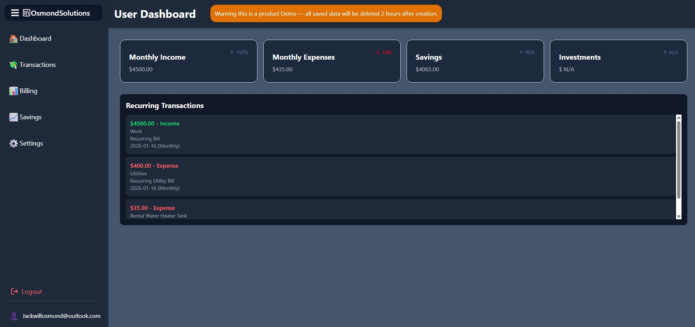

# Personal-Finances-Tracker

A streamlined, beginner‑friendly collection of tools and resources designed to help individuals take control of their money with confidence. The goal was to create Recurring payments, and one-time payment manager. This project was a capstone assignment for Grade 12 Computer Science.

## Features

Input payments and account creation with forms:

- Email account creation
- One-time payment forms
- Recurring payment forms
- Both forms containing:
  - Amount
  - Type
  - Catagory
  - Description
  - Dates

Frontend UX:

- Simplistic design
- Desktop orientated
- External links to official pages
- Responsive layout and loading/empty states

Account safety and database saving backend:

- SQLite database
- JWT token authorization per user login
- Password hashing
- Automatic database clearing with account deletion
- Automatic account deletion after account unverified for 2 hours

**Frontend:**

- React + Typescript
- Vite
- TailwindCSS
- Ease setup to servers

**Backend:**

- .NET SDK v9.0
- Custom backend services
- SQLite

## How It Works

1. The backend creates a database for account and transaction saving.
2. Create accounts and sign in via forms from the frontend.
3. A JWT login token is created to securely transport information.
4. Transactions database to track user data with:
   - UserID
   - Income or Expense
   - Category
   - Description
   - Amount
   - Date
5. Add recurring transactions with:
   - Start and end dates
   - Anually, quarterly, biweekly or weekly automatic payments
   - Automatically create transactions at the designated time
6. Creates a dashboard based off your inputed data.
7. Logout anytime and revokes user tokens for signing out across multiple tabs.



## Running Locally

```bash
dotnet run
```

Runs on:
A local host of your choice. (Currently setup for my server, change the ips to localhost)

### Frontend

```bash
npm install
npm run dev
```

Runs on:
A local host of your choice.

---

## Acknowledgements

- DB Browser for SQLite for database testing
- Insomnia for API backend testing
- Open-source community
